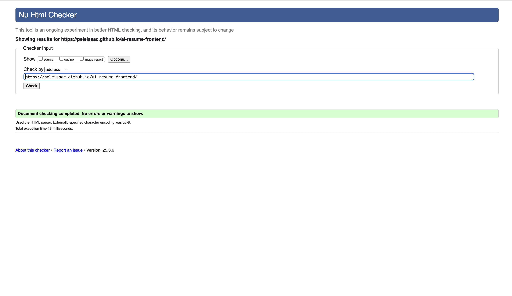

# AI Resume Application
The AI Resume Application is a comprehensive web-based platform built with a Django Rest Framework backend and HTML, CSS, JavaScript frontend. It provides an intelligent matching system that connects job seekers with relevant opportunities while helping employers find qualified candidates efficiently.


## Overview
Our AI resume project is designed to meet the needs of two main target audiences: job seekers and employers.

**For job seekers**, the platform streamlines the process of finding relevant job opportunities. By uploading their resumes, job seekers receive personalized job matches tailored to their skills, experience, and preferences—reducing the time and effort needed to search for opportunities manually. This directly addresses their need for quick, accurate, and relevant job matching, increasing their chances of finding the right role faster.

**For employers**, the platform provides access to a pool of qualified candidates that match their job requirements. Using AI algorithms, the system analyzes candidate profiles and resumes to highlight the best fits for a given role. This saves employers time in the recruitment process and helps them find candidates whose skills align with their specific needs.

By focusing on these two target audiences, our platform bridges the gap between job seekers and employers—offering a smarter, data-driven approach to recruitment and job discovery.

## Security Features
We prioritize security to protect users' sensitive information and ensure a trustworthy experience across both frontend and backend:

### Frontend Security
- **HTTPS**: Ensuring secure data transmission via SSL/TLS
- **Authentication/Authorization**: Using secure login flows with Token-based Authentication
- **Input Validation**: Sanitizing user inputs to prevent injection attacks
- **XSS Protection**: Escaping dynamic content and applying CSP headers
- **CSRF Protection**: Using anti-CSRF tokens for sensitive operations
- **Secure File Uploads**: Limiting file types and size in resume uploads
- **Dependency Updates**: Keeping frontend libraries up to date
- **User Privacy**: Clear data handling notices and compliance

### Backend Security
- **HTTPS**: Enforce secure data transfer using HTTPS
- **Authentication/Authorization**: Strong session/token management using Token-based authentication
- **Input Validation**: Sanitize inputs to prevent injections (SQL, XSS)
- **File Upload Security**: Validate file types and sizes before uploading to Azure blob storage
- **Database Security**: Use MVC, parameterized queries, and least privilege
- **Logging & Monitoring**: Detect suspicious activities by logging all activities
- **Environment Management**: Use .env for sensitive settings, no hard-coded secrets
- **Regular Updates**: Patch libraries and dependencies

## Table of Contents
- [User Stories](#user-stories)
- [Refined Epics to User Stories to Tasks](#refined-epics-to-user-stories-to-tasks)
- [Features](#features)
- [Wireframes](#wireframes)
- [Technologies Used](#technologies-used)
- [Architecture](#architecture)
- [Database Schema](#database-schema)
- [Setup Instructions](#setup-instructions)
- [Testing](#testing)
- [Deployment](#deployment)

## User Stories

### Job Seeker User Stories
- As a job seeker, I want to upload my resume so that I can be matched with relevant job opportunities
- As a job seeker, I want to see a list of jobs so that I can quickly find jobs or filter for jobs I can apply for
- As a job seeker, I want to save jobs I'm interested in so that I can apply later
- As a job seeker, I want my personal data to be protected and only shared with employers when I give consent

### Employer User Stories
- As an employer, I want to post job openings so that I can attract qualified candidates and also edit jobs I have already posted
- As an employer, I want to search for candidates based on their uploaded resumes and skills so that I can find the best match for my job roles
- As an employer, I want to view matched candidates for a job opening so that I can quickly shortlist potential hires
- As an employer, I want to view analytics and insights on the number of applications and matched candidates for my posted jobs
- As an employer, I want to update the status of candidates who applied for a job

## Refined Epics to User Stories to Tasks
In defining our epics, user stories and tasks, Jira was chosen for this task. Find below the evidence of refined epics to User Stories to Tasks using Jira where epics were refined to user stories and user stories were broken down into tasks to be completed.


## Features 

### Frontend Features
- Clean and modern UI for resume uploads
- Responsive design for all screen sizes
- Simple and lightweight interface
- Easy customization with CSS
- Clean and intuitive dashboards for Jobseekers and Employers

### Backend Features
- REST APIs to manage, query and manipulate user data
- Resume upload and storage in Azure containers using REST API
- Database Management System using MySQL
- Token-based authentication
- AI-powered job matching algorithms

## Wireframes
This link routes you to the initial design (Wireframes) used for the development of the frontend: [UI Link](https://www.figma.com/design/0MprAOSLilpKR2YGMgiwKr/JOB-APP?node-id=0-1&p=f&t=7t4SQqRJaZIMDZr4-0)

## Technologies Used

### Frontend
- **HTML** – Structure and layout
- **CSS** – Styling and responsiveness  
- **JavaScript** – For dynamism of the website

### Backend
- **Django Rest Framework** – Backend logic, routing, and data manipulation
- **MySQL** – Database management system
- **Azure Blob Storage** – Resume file storage
- **Token Authentication** – Secure user authentication

## Architecture
The application follows a client-server architecture:
- **Frontend**: Static HTML/CSS/JavaScript served via django and deployed via Heroku
- **Backend**: Django REST APIs deployed on Azure VM
- **Database**: MySQL for structured data storage
- **File Storage**: Azure Blob Storage for storing and retrieving resume / CV files

## Database Schema

### Entities and Attributes

#### Users
- **user_id** (PK)
- **first_name**
- **last_name**
- **resume_url**
- **company_name**
- **contact_name**
- **address**
- **industry**
- **company_description**
- **msisdn** (unique)
- **gender**
- **user_role**
- **dob**
- **region**
- **city**
- **socials**
- **category_of_interest**
- **job_notifications**
- **updated_at**
- **email** (unique)
- **is_active**
- **is_staff**
- **is_superuser**
- **record_status**

#### Jobs
- **id** (PK)
- **job_id** (unique)
- **employer_id**
- **title**
- **description**
- **category**
- **contract_type**
- **company_name**
- **experience**
- **education_level**
- **requirements**
- **required_skills**
- **benefits**
- **region**
- **city**
- **no_of_vacancies**
- **salary**
- **created_at**
- **updated_at**
- **is_active**
- **record_status**

#### Applications
- **id** (PK)
- **application_id** (unique)
- **status**
- **user_id** (FK)
- **employer_id** (FK)
- **job_id** (FK)
- **created_at**
- **updated_at**
- **record_status**

#### Saved Jobs
- **id** (PK)
- **saved_job_id** (unique)
- **user_id** (FK)
- **employer_id** (FK)
- **job_id** (FK)
- **created_at**
- **updated_at**

### Relationships
- **Users** entity is managed by **CustomUserManager**
- **Users** entity has static methods for various operations
- **Jobs** entity has static methods for various operations
- **Applications** entity has static methods for various operations
- **Applications** entity has foreign keys to **Users** and **Jobs** entities
- **Saved Jobs** entity has foreign keys to **Users** and **Jobs** entities

### ER Diagram

```plaintext
+------------------+          +----------------------+          +------------------+
|    Users         |          |  CustomUserManager   |          |    Jobs          |
+------------------+          +----------------------+          +------------------+
| user_id (PK)     |          | create_user()        |          | id (PK)          |
| first_name       |          | create_superuser()   |          | job_id (unique)  |
|                  |          |                      |          | employer_id (FK) |                  
| last_name        |          | get_user_by_user_id()|          | title            |
| resume_url       |          | is_profile_complete()|          | description      |
| company_name     |          | get_user_by_user_id_json_format()| category        |
| contact_name     |          +----------------------+          | contract_type    |
| address          |                                             | company_name    |
| industry         |                                             | experience      |
| company_description |                                         | education_level  |
| msisdn (unique)  |                                             | requirements     |
| gender           |                                             | required_skills  |
| user_role        |                                             | benefits         |
| dob              |                                             | region           |
| region           |                                             | city             |
| city             |                                             | no_of_vacancies  |
| socials          |                                             | salary           |
| category_of_interest |                                         | created_at       |
| job_notifications|                                             | updated_at       |
| updated_at       |                                             | is_active        |
| email (unique)   |                                             | record_status    |
| is_active        |                                             +------------------+
| is_staff         |
| is_superuser     |
| record_status    |
+------------------+

+------------------+                   
| Applications     |
+------------------+
| id (PK)          |
| application_id (unique)|
| status           |
| user_id (FK)     |
| employer_id (FK) |
| job_id (FK)      |
| created_at       |
| updated_at       |
| record_status    |
+------------------+

+------------------+
| Saved Jobs       |
+------------------+
| id (PK)          |
| saved_job_id (unique) |
| user_id (FK)
| employer_id (FK) |
| job_id (FK)      |
| created_at       |
| updated_at       |
| record_status    |
+------------------+
```

## Setup Instructions

### Fullstack Setup

1. **Clone the project repository**:
   ```bash
   git clone https://github.com/peleisaac/ai-resume-backend.git
   ```

2. **Install Dependencies**:
   Make sure you have Django installed. Set up a virtual environment and install dependencies:
   ```bash
   python3 -m venv venv # Use python for Windows systems
   source venv/bin/activate  # On Windows use `venv\Scripts\activate`
   pip install -r requirements.txt # Use pip3 for Linux and Mac systems
   ```

3. **Apply the migrations**:
   ```bash
   python manage.py migrate # Use python3 for Linux and Mac systems
   ```

4. **Run the Server**:
   Start the Django development server:
   ```bash
   python manage.py runserver # Use python3 for Linux and Mac systems
   ```

## Testing

### Frontend Manual Testing
Manual testing was performed on the developed frontend with the following checklist:

✅ Users fill out forms and submit them without errors

✅ Form validation messages clear

✅ Dropdowns and modals work as expected

✅ The layout adjusts to mobile/desktop screens

✅ The API errors show clearly (e.g., "Failed to fetch jobs")

✅ The sensitive data are stored securely (e.g., user account data is stored in localStorage only when user is authenticated successfully)

### Backend Automated Testing
Automated testing was implemented for the backend. Sample test cases can be found in the `tests.py` file.

### Validator Testing

#### Project Validation from the Official W3C Validator


#### Project Validation from the Official Jigsaw Validator


## Deployment

### Frontend Deployment (Heroku Deployment)
This project's frontend was deployed using heroku with the following steps:

- Create an account on Heroku and login
- Click on New > Create New App
- Give it an app name and select location after which you click on the create app button below
- After creating the app under the project, click on the app and click on the deploy navigation bar at the top beneath your project name
- Under the deploy section, look for deployment method and select Heroku git
- Follow the steps listed under the Deploy using Heroku Git section where a deployed link will be generated for you after a successful build
- You can then click open app at the top right section to view your deployed app or copy the deployed link that is generated in the terminal after the successful build and paste it in any browser of your choice.
- In case you encounter errors in the build during deployment, you can click on the more button at the top right in your project on heroku and select view logs to view the error logs after which you can rebuild after fixing the errors

### Backend Deployment (Azure VM)
The backend was deployed using a Virtual Machine on Azure with the following steps:

1. **Create Azure VM**:
   - Create a new VM (Ubuntu 22.04 LTS)
   - Assign a public IP address and configure security groups to allow SSH (port 22), HTTP (port 80), and HTTPS (port 443)

2. **Connect to VM**:
   ```bash
   ssh your_username@your_server_ip
   ```

3. **Update & Install Essential Packages**:
   ```bash
   sudo apt update && sudo apt upgrade -y
   sudo apt install python3-pip python3-venv python3-dev build-essential libpq-dev nginx git -y
   ```

4. **Clone Repository**:
   ```bash
   git clone https://github.com/peleisaac/ai-resume-backend.git
   ```

5. **Set Up Virtual Environment**:
   ```bash
   python3 -m venv venv
   source venv/bin/activate
   ```

6. **Install Project Dependencies**:
   ```bash
   pip install --upgrade pip
   pip install -r requirements.txt
   ```

7. **Configure Django Settings**:
   - Set `ALLOWED_HOSTS` in settings.py to include your server IP/domain
   - Set `DEBUG=False` for production
   - Configure `STATIC_ROOT` and `MEDIA_ROOT` in settings.py
  
8. **Set Up MySQL Database**
   - Install MySQL Server
   - ```bash
         sudo apt install mysql-server libmysqlclient-dev -y
      ```
   - Secure MySQL Installation
   - ```bash
   sudo mysql_secure_installation
   ```
   - Log In to MySQL
   - ```bash
   sudo mysql -u root -p
   ```
   - Create Database and User
   - ```bash
   CREATE DATABASE your_db_name CHARACTER SET UTF8MB4 COLLATE UTF8MB4_GENERAL_CI;
   CREATE USER 'your_db_user'@'localhost' IDENTIFIED BY 'your_db_password';
   GRANT ALL PRIVILEGES ON your_db_name.* TO 'your_db_user'@'localhost';
   FLUSH PRIVILEGES;
   EXIT;
   ```
   - Update Django settings.py Database Configuration
   - ```bash
   DATABASES = {
    'default': {
        'ENGINE': 'django.db.backends.mysql',
        'NAME': 'your_db_name',
        'USER': 'your_db_user',
        'PASSWORD': 'your_db_password',
        'HOST': 'localhost',
        'PORT': '3306',
       }
   }
   ```
   - Install MySQL Client for Django
   - ```bash
   pip install mysqlclient
   ```

9. **Collect Static Files**:
   ```bash
   python manage.py collectstatic
   ```

10. **Apply Database Migrations**:
   ```bash
   python manage.py migrate
   ```

11. **Set Up Gunicorn as Application Server**:
    ```bash
    pip install gunicorn
    gunicorn --bind 0.0.0.0:8000 your_project_name.wsgi:application
    ```

12. **Configure Supervisor to Manage Gunicorn**:
    ```bash
    sudo apt install supervisor
    sudo nano /etc/supervisor/conf.d/your_project.conf
    ```

    Example Config:
    ```bash
    [program:your_project]
    command=/home/your_username/your-repo/venv/bin/gunicorn --workers 3 --bind unix:/home/your_username/your-repo/your_project.sock your_project_name.wsgi:application
    directory=/home/your_username/your-repo
    user=your_username
    autostart=true
    autorestart=true
    stdout_logfile=/var/log/your_project/gunicorn.log
    stderr_logfile=/var/log/your_project/gunicorn_error.log
    ```

13. **Create Log Directories & Reload Supervisor**:
    ```bash
    sudo mkdir -p /var/log/your_project/
    sudo chown -R your_username:your_username /var/log/your_project/
    sudo supervisorctl reread
    sudo supervisorctl update
    sudo supervisorctl status
    ```

14. **Configure Nginx as Reverse Proxy**:
    ```bash
    sudo nano /etc/nginx/sites-available/your_project
    ```

    Example Config:
    ```bash
    server {
        listen 80;
        server_name your_domain.com your_server_ip;

        location = /favicon.ico { access_log off; log_not_found off; }
        location /static/ {
            root /home/your_username/your-repo;
        }

        location /media/ {
            root /home/your_username/your-repo;
        }

        location / {
            include proxy_params;
            proxy_pass http://unix:/home/your_username/your-repo/your_project.sock;
        }
    }
    ```

15. **Enable the Config**:
    ```bash
    sudo ln -s /etc/nginx/sites-available/your_project /etc/nginx/sites-enabled
    sudo nginx -t
    sudo systemctl restart nginx
    ```

16. **Secure with HTTPS (Optional but Recommended)**:
    ```bash
    sudo apt install certbot python3-certbot-nginx -y
    sudo certbot --nginx -d your_domain.com
    ```

## Repository Links
- **Fullstack Project Repository**: https://github.com/peleisaac/ai-resume-backend.git
- **Live Full stack project**: [https://ai-resume-project-a1df6159c7ca.herokuapp.com/](https://ai-resume-project-a1df6159c7ca.herokuapp.com/)

